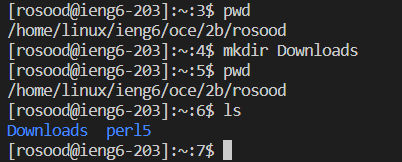
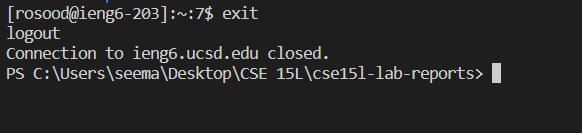
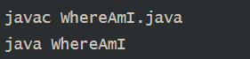

**Hello!** 
 My name is Roshan Sood and I am a student
 in CSE 15L.
 You can find my GitHub here at: https://github.com/YeetOnMyFeet

 [Report 2](lab-report-1-week-0.md)
 [Report 3](lab-report-1-week-5.md)
 [Report 4](lab-report-4-week-7.md)
 ## Part 1- Installing VSCode

Go to  [VSCode](https://code.visualstudio.com/download)
to download the applicatiion

VSCode is a code editor used to design and run programs. It features debugging(fixing errors in code), syntax highlighting, and code refactoring for your projects. 

We will use VSCode for connecting to our server and writing commands directly to our server. 

It should look like this when you install

* This step I simply downloaded VSCode and ran the environment
* I made sure to set it up for java

## Part 2- Connecting to SSH

* Install OpenSSH on  [OpenSSH](https://learn.microsoft.com/en-us/windows-server/administration/openssh/openssh_install_firstuse?tabs=gui)

* Find your username (ex. "cs15lfa22zz") on https://sdacs.ucsd.edu/~icc/index.php by resetting your password

* Use the query "ssh cs15lfa22zz@ieng6.ucsd.edu" but 
with the zz replacing your own letters

* It should look like this

SSH means Secure Shell and is a command that allows us to connect to our server and send commands + information between computers. We can also transfer data from our local pc to our server.

## Part 3- Commands
These listed commands allow us to manipulate our directory and see our data within our folders
* cd - navigate forwards through folders
* ls - ls the current directory
* pwd - print the current location in the file system
* mkdir - make a new directory

* It should look like this

Logout is simply "exit" in the terminal

## Part 4- Moving files with scp

* Create a file on your computer named WhereAmI.java with
following code

* Compile and run using javac and java as directed

* To transfer the files using scp you call 
"scp WhereAmI.java cs15lfa22zz@ieng6.ucsd.edu:~/"
* Enter your password

## Part 5- SSH Keys
* Run the command "ssh-keygen"
* SSH keygen is used to generate keys in order to link files to your account without having to login with your password
* Keygen generates keys for you to login with
* We need it because it makes it easier to login
* Enter a file to save the keys on a filepath
* -The file is your own file you created to save the keys
* Input a passphrase to save your identification
* A good practice is to save your passphrase as your file name or something similar to it to easily remember your passphrase

## Part 6- Optimizing Remote Running
* You can use quotes at the end of an ssh comand 
to directly run it on the remote server: cs15lfa22@ieng6.ucsd.edu "ls"
* You can also use semicolons to run multiple commands on one line: "cp WhereAmI.java OtherMain.java; javac OtherMain.java; java WhereAmI"
*The up arrow allows you to move back to your last line in the terminal

