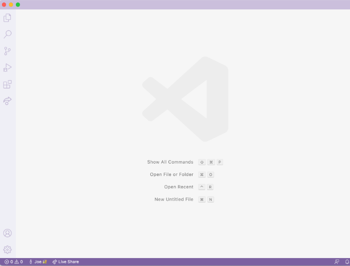
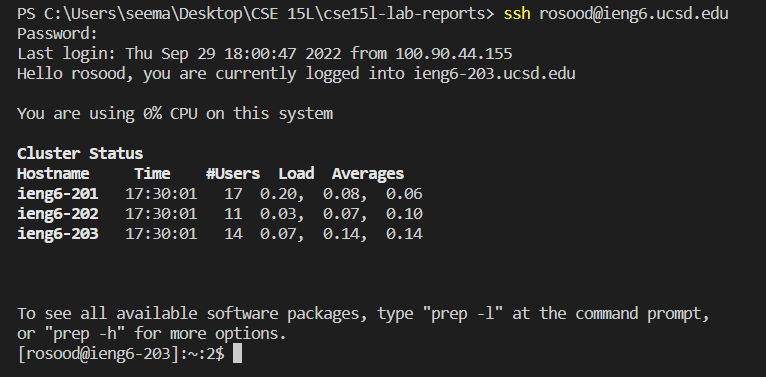
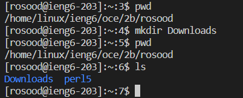
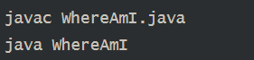
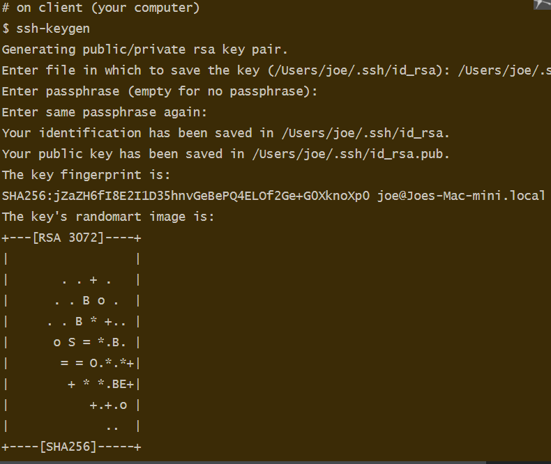

**Hello!** 
 My name is Roshan Sood and I am a student
 in CSE 15L.
 You can find my GitHub here at: https://github.com/YeetOnMyFeet

 ## Part 1- Installing VSCode

Go to  [VSCode](https://code.visualstudio.com/download)
to download the applicatiion

It should look like this when you install

* This step I simply downloaded VSCode and ran the environment
* I made sure to set it up for java

## Part 2- Connecting to SSH

* Install OpenSSH on  [OpenSSH](https://learn.microsoft.com/en-us/windows-server/administration/openssh/openssh_install_firstuse?tabs=gui)

* Find your username (ex. "cs15lfa22zz") on https://sdacs.ucsd.edu/~icc/index.php by resetting your password

* Use the query "ssh cs15lfa22zz@ieng6.ucsd.edu" but 
with the zz replacing your own letters

* It should look like this

## Part 3- Commands

* cd
* ls
* pwd
* mkdir
* ls <directory>

* It should look like this

Logout is simply "exit" in the terminal

## Part 4- Moving files with scp

* Create a file on your computer named WhereAmI.java with
following code
* Compile and run using javac and java as directed

* To transfer the files using scp you call 
"scp WhereAmI.java cs15lfa22zz@ieng6.ucsd.edu:~/"
* Enter your password

## Part 5- SSH Keys
* Run the command "ssh-keygen"
* Enter a file to save the keys on a filepath
* Input a passphrase to save your identification

## Part 6- Optimizing Remote Running
* You can use quotes at the end of an ssh comand 
to directly run it on the remote server: cs15lfa22@ieng6.ucsd.edu "ls"
* You can also use semicolons to run multiple commands on one line: "cp WhereAmI.java OtherMain.java; javac OtherMain.java; java WhereAmI"
*The up arrow allows you to move back to your last line in the terminal

