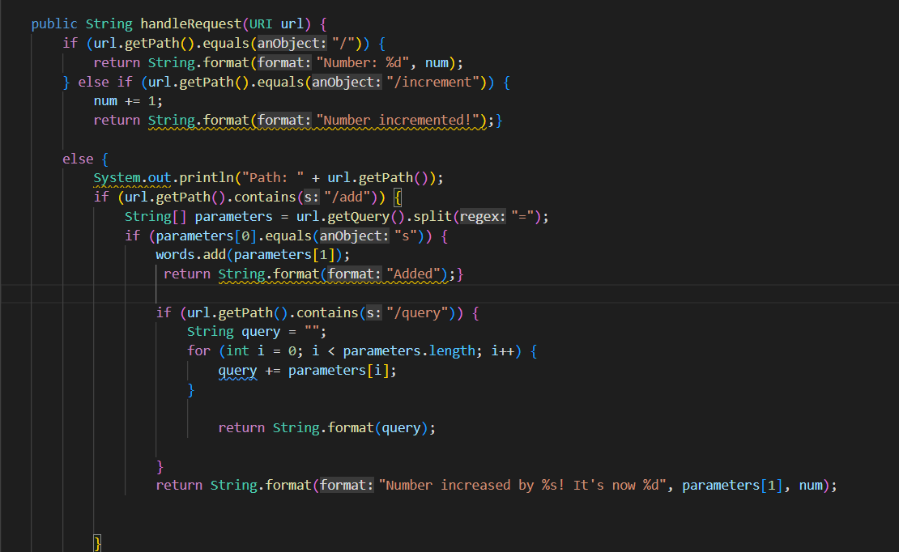
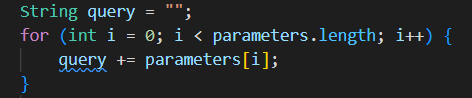
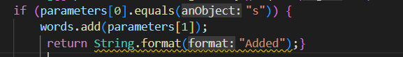
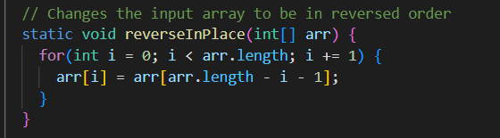
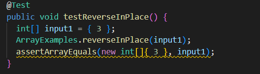
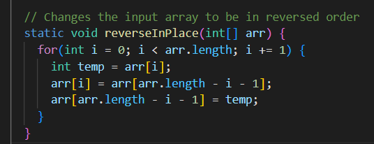
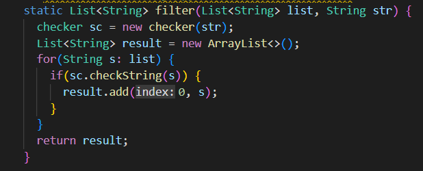
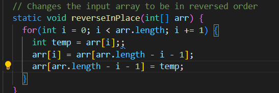

## Part 1 - Simplest Search Engine

* URL Handler and Query are the main methods in my code being called. This because they are checking and splitting each input for specific queries to return. For example, url.getPath().contains() is checking if the path contains add.

* The values to the relevant arguments are add and query because they are within the conditions to check the path. Query is string being added to which querys the lists of strings. Moreover, values like parameters and words are lists created to add values from each input query.

* The values of the request change when you do things like add a word. Once you add a word, you can search for it since it is being added to the list. 

 ## Part 2- Two Bugs

### Bug 1: Array Examples- ReversedInPlace
* This bug does not reverse the indexes of the array and instead erases the value at the initial index

* Symptom in test: Returned array is full of 0’s

* Fixed code, I created a temp variable to swap indexes and keep track of the one being swapped and the one not swapped

- Connection between bug and symptom
* The bug does not modify the array with the parameter return values
* The bug causes this symptom because 

### Bug 2 ListExamples.java - filter
* This bug does not correctly filter the array, the elements of the array will be added at the beginning of the new array, hence not keeping the list in the same order

* Symptom in test: The elements of the array are returned in reverse order 

* Fixed code, I added each element to the end of the list so that the list appends it in the correct order.

-Connection between bug and symptom
* The bug caused the symptom as it placed the filtered values at the front of the list which changed the order. This would add the values to the front, putting the list in the incorrect order and causing the error in the code.  

