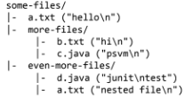
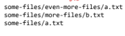
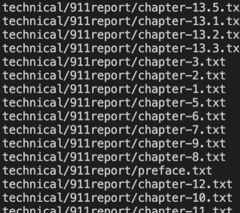
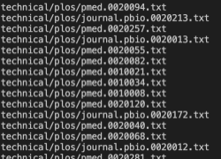
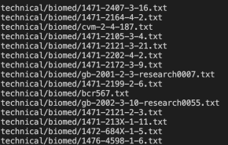

## Part 1 - Commands
- The "find" command
* This command lists all files in current folder and subfolders with given pattern

* Ex. "find some-files -name *.txt/" would find all the files in the directory which are:



### Find Alternatives
* An alternative to the find command is the "-type" command
* -type is tool similar to the find command that is used to find files on a system using their extension
* The command is

``` 
# find -type command 1

find -type technical *.txt

Output: 
```


``` 
# find -type command 2

find technical/plos -type *.txt

Output: 
```



``` 
# find -type command 3

find -type technical/biomed -type *.txt 

Output: 
```




* The type command is designed to find entries in a filesystem by their name or extension. It is useful because it is another way to easily access specific files in a system without explicity searching their names or using the "find" command to find them. This makes finding files easy by just specifying the type to find them.
* Type is a efficient command as it matches the extension to the file

### -name alternative
* -name searches for the file by the extension or name
* The command is 

``` 
# find name command 1

find technical/plos -name *.txt 

Output: 
```


``` 
# find name command 2

find technical -name "government" 

Output: 
```


``` 
# find name command 3

find technical/911report -name "chapter-2.txt" 

Output: 
```


* The name command is designed to find entries based off of arguments passed in like extension or file name. This is useful because it can access a specific file by searching through the file type, adding a new way to access a file. 
* Find name can be used to find files with a certain name or extension
* -name finds the name of the file you are looking for, directly returning the file instead of returing a directory full of similar files
* This makes it simple and easy to use to find files


### ls alternative 
* -ls lists the files in the directory 
* The command is

``` 
# find ls command 1

find technical -ls 

Output: 
```


``` 
# find name command 2

find technical/biomed -ls 

Output: 
```
(image becomes too long)


``` 
# find name command 3

find technical/911report -ls  

Output: 
```
(image becomes too long)


* The ls command is designed to list out the directory to find specific files within in
* A single ls call to a specific path will list all files in the path
* This is useful because it can help someone find a specific file in a folder
* It can also list the files currently stored in a directory to show what that directory is about/contains


