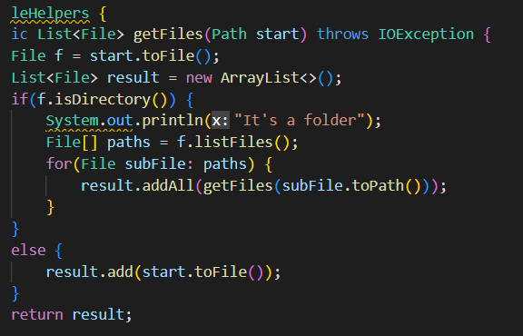
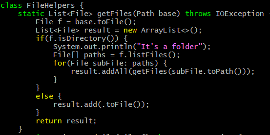

## Part 1 - Vim Commands
* The shortest sequence of vim commands for the task:
```
Changing the name of the start parameter and its uses to base
```
* First of all, to vim into the file we type vim DocSearchServer.java into the terminal

* vim allows you to edit text in files through the terminal

Before we change anything the code looks like this:

* Next, to change name to 'base' we use the command

```
:%s/name 
<Enter>
base
<Enter>
```
* This finds all instances of name and changes it to start

* The : and s allows us to highlight the lines we want to change and replace while the % reads the whole file 

* The /name is the command we want to replace 

* After we press enter, we need to type in base and enter again to switch all instances of name with base

It should look like this: 


### Part 2
* It took me roughly a minute for the first task mainly because I had to login to the server and scp which took the majority of the time
* The second step took me roughly 30 seconds since I was already logged into the server and only had to run a few commands to edit and run the file 

### Questions
"Which of these two styles would you prefer using if you had to work on a program that you were running remotely, and why?"

* I would prefer the second step mainly because it takes less time. Moreover, making the edit it vim is easier because I can use commands like ':%s/' to find and replace effiently. Lastly, vim makes it easy to edit and run files in a server without constantly scp'ing to them.

"What about the project or task might factor into your decision one way or another? (If nothing would affect your decision, say so and why!)"

* The use of a server would factor my decision because it is just so much easier to use vim and edit files from the server than using the first style. Moreover, this style would save time and make editing/running code more efficent. This is significant because the use vim is mainly utilized for server work since it fosters efficiency as you can edit and run without constant copying and logging into the server from your local machine.

