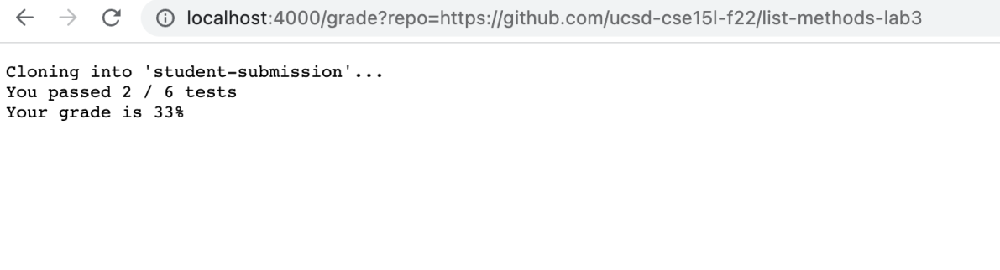
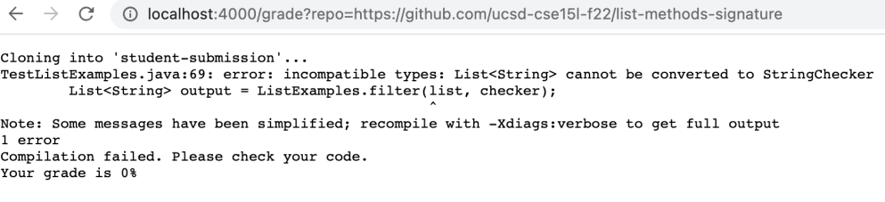
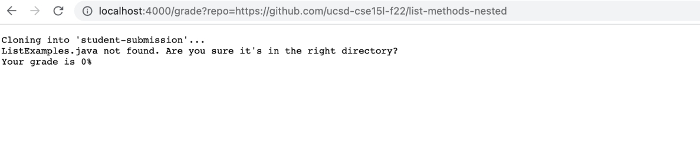

## Part 1 - grade.sh script(autograder)
* Our groups autograding script:
```
Create your grading script here

set -e

CPATHTESTS=".:../lib/hamcrest-core-1.3.jar:../lib/junit-4.13.2.jar"

rm -rf student-submission
git clone $1 student-submission

if [ -f "./student-submission/ListExamples.java" ]
then
    cp TestListExamples.java ./student-submission
    cd ./student-submission
    set +e
    javac -cp $CPATHTESTS *.java
    if [ $? -eq 0 ]
    then
        java -cp $CPATHTESTS org.junit.runner.JUnitCore TestListExamples > output.txt
        if [ $? -eq 0 ]
        then
            echo "All tests passed"
            echo Your grade is 100%
            exit 0
        fi
        t=$(grep -i "Tests run" output.txt)
        elements=$(echo $t | tr " " "\n")
        counter=0
        total=""
        passed=""
        for i in $elements
        do
            if [ $counter == 2 ]
            then
                total=${i%?}
            fi
            if [ $counter == 4 ]
            then
                passed=$i
            fi
            counter=$((counter+1))
        done
        if [ "$passed" != "" ]
        then
            echo You passed "$((total - passed))" / $total tests
            echo Your grade is "$((((total - passed)*100/total*100)/100))"%
        fi
    else
        echo Compilation failed. Please check your code.
        echo Your grade is 0%
    fi
else
    echo "ListExamples.java not found. Are you sure it's in the right directory?"
    echo Your grade is 0%
    exit 1
fi

```
* Screenshot 1-https://github.com/ucsd-cse15l-f22/list-methods-lab3

* This repo passes a few tests which gives a grade of 33%
* Screenshot 2-https://github.com/ucsd-cse15l-f22/list-methods-signature

* This repo doesn't pass. An error occurs in line 69 of TestListExamples
* Screenshot 3-https://github.com/ucsd-cse15l-f22/list-methods-nested

* This repo doesn't pass because it cannot find the ListExamples.java file

### Tracing screenshot 1-https://github.com/ucsd-cse15l-f22/list-methods-lab3
For this screenshot, the code will run up to the if statement " if [ "$passed" != "" ]" after the for loop

The first if statement passes because it finds the file within the repo, allowing the repo to be analyzed for a grade

The second if statement does not pass since it is checking if the exit code equals 0, which it doesn't

The third if statement won't pass because it is checking if the exit code equals 0, which it doesn't, sending the code into the if statements in the for loop.

In the for loop, only the first if statement will run since only 2/6 tests pass, giving the number of test that pass in the then section of the if statement(counter counts the number of tests passing in the for loop, and the loop only iterates twice, setting counter == 2 and executing the then)

The final two if statements don't get checked because the code finishes after it displays the grade in the if statement after the for loop.

Besides the if statements that don't get called, every other line runs

Since the second if statement yields standard error and output into another file, this specific repo would not yield any because the if statement fails as the exit code is not 0.